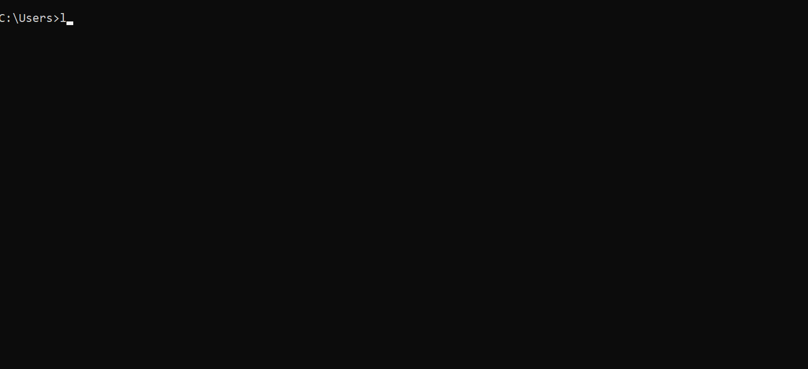

### Aspire to expose your localhost to the Internet with minimal effort? Do you wish to avoid going through the tedious deployment process ? 

<font size="4"> Let me introduce you to Loophole. </font>

 ### So, what's Loophole?

 In simple words, Loophole allows you to make your Web application public without actually deploying on a cloud service. It provides a user-friendly domain that you can share with your remote users/friends/teammates to try/use your WebApp. 

 ### Let's give Loophole a try!

Firstly, create an account with Loophole . By creating an account, you get access to all the features loophole provides in its beta version. [Download the latest version of Loophole here.](\download)
<br/>
<br/>

 **Getting Started**
 
 In windows, click the loophole.zip file to unzip. 

 For Mac and Linux, use terminal with the following command:

 
```bash
$ unzip /path/to/loophole.zip
```
<br/>

 **Authenticating Loophole CLI for all feature access**




**Running our local server project**

 Here we consider a simple gatsby server for representation purposes. **The webapp is running on port 8000.** 

```javascript
const os = require('os');
const express = require('express');

const port = process.env.PORT || 8000;
const app = express();

app.get('/*', function (req, res) {
  const hostname = os.hostname();
  res.json({hostname, version: '2'});
});

app.listen(port, () => {
  console.log(`demo-app listening on port ${port}`);
});
```

Now all we have to do let Loophole know the port our local server is running on! After authentication,follow the below instructions:


Note: **If your app is running on a different port , just replace 8000 with your respective port.**

**Example** - For an app running on port 8080, the command will be 

```bash
$ loophole 8080
```
and it fires a HTTPS secured tunnel for you!

You are now LIVE...
**Share the URL with people you want to show your web application. It is that simple.**

<br/>

There are endless possibilities with Loophole. You can create a custom domain, or share a QR code than a URL. I would cover those features individually in other blog posts. For more details, you can refer to the [Documentation](\docs) here. 


